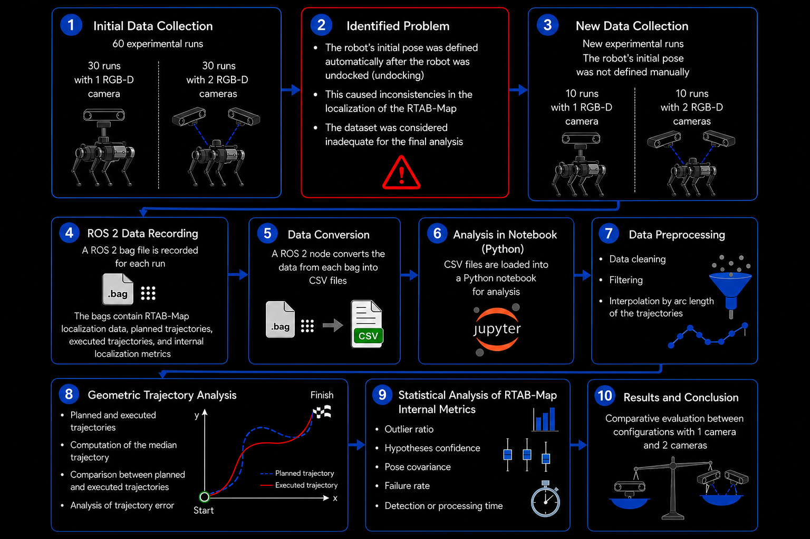

# Multi-Camera Localization Benchmark — Unitree Go2 + RTAB-Map

<p align="center">
  
</p>

> Comparative analysis of RTAB-Map localization quality on the Unitree Go2 quadruped robot using one vs. two Intel RealSense RGB-D cameras. Master's research project — Centro Universitário FEI, Data Science course.

---

## Overview

This project benchmarks whether adding a second RGB-D camera improves RTAB-Map's visual localization on a Unitree Go2 robot equipped with a BotBrain Pro computing stack (Jetson AGX). Twenty experimental runs were collected — 10 with two cameras and 10 with one — and analyzed across two dimensions:

1. **Trajectory quality** — how closely the robot followed the planned NAV2 path
2. **Internal localization metrics** — feature tracking, loop closure confidence, pose uncertainty, and processing latency

**Key finding:** Despite identical final trajectories (RMSE difference < 2 mm), one camera outperformed two cameras on internal metrics due to a USB bus bandwidth bottleneck — both cameras were connected to the same USB 3.0 bus on the Jetson AGX, causing frame loss under simultaneous streaming.

---

## Results Summary

| Metric | Two Cameras | One Camera | Better |
|--------|-------------|------------|--------|
| Trajectory RMSE | 0.1122 m | 0.1104 m | ≈ tie |
| Median failure rate (`inlier_ratio = 0`) | 31.4 % | 23.5 % | One camera |
| Median `inlier_ratio` | 0.0958 | 0.1480 | One camera |
| Frames with max loop-closure confidence | 70.9 % | 45.6 % | Two cameras |
| Median pose uncertainty (`cov_pos_trace`) | 0.0094 | 0.0053 | One camera |
| Median detection latency | 386 ms | 252 ms | One camera |

---

## Repository Structure

```
ros2_ws/src/
├── localization_analysis/          # ROS 2 data-collection package
│   ├── localization_analysis/
│   │   └── localization_logger.py  # ROS 2 node (subscribes & writes CSVs)
│   ├── data/
│   │   └── logs/
│   │       ├── logger_csv_1/       # Runs 1–10: two cameras
│   │       │   ├── localization_log.csv
│   │       │   └── plan_log.csv
│   │       └── ...                 # logger_csv_11–20: one camera
│   ├── package.xml
│   └── setup.py
├── graphs/                         # Publication-ready SVG figures (38 files)
├── docs/
│   └── methodology.png             # Pipeline diagram (used as cover above)
├── main.ipynb                      # Primary analysis notebook
├── wrong_cov.ipynb                 # Exploratory / legacy notebook
├── run_all_bags.sh                 # Batch replay of all rosbags
├── record_tryout.sh                # Recording helper script
├── requirements.txt                # Python dependencies
└── README.md
```

---

## Methodology

### Data Collection (Steps 1–4)

An initial dataset of 60 runs was collected and discarded after identifying that the robot's initial pose was set automatically after undocking, causing inconsistencies in RTAB-Map localization. A new dataset of 20 runs was collected with the initial pose defined manually:

- **Runs 1–10**: Unitree Go2 with **two** Intel RealSense RGB-D cameras
- **Runs 11–20**: Unitree Go2 with **one** Intel RealSense RGB-D camera

Each run was recorded as a ROS 2 bag file containing `/rtabmap/info`, `/localization_pose`, and `/plan` topics.

### Data Conversion & Loading (Steps 5–6)

A ROS 2 node (`localization_logger.py`) replayed each bag and exported two CSV files per run:

| File | Contents |
|------|----------|
| `localization_log.csv` | Per-update RTAB-Map metrics: inliers, matches, inlier ratio, hypothesis ratio, loop closure ID, working memory size, detection time, total time, pose (x, y, yaw), covariance diagonal |
| `plan_log.csv` | Planned path waypoints from NAV2, grouped by `plan_id` |

### Pre-processing (Step 7)

All trajectories were normalized to enable fair cross-run comparison:

1. **Winsorization** — extreme poses removed (1st/99th percentile per axis)
2. **Arc-length parameterization** — each path mapped to \[0, 1\] proportionally to cumulative distance
3. **Uniform resampling** — all paths interpolated to the same number of points

Point-wise medians were then computed per configuration group.

### Geometric Analysis (Step 8)

- Median planned path vs. median executed path per group
- Point-wise RMSE between executed runs and the global median plan
- Visual overlay of all 10 runs per configuration

### Internal Metrics Analysis (Step 9)

Statistical comparison of RTAB-Map's internal quality signals:

- **`inlier_ratio`** — fraction of BoW words consistent after RANSAC; values near 0 indicate tracking loss
- **`hypothesis_ratio`** — loop closure confidence (1 = maximum certainty)
- **`cov_pos_trace`** — translational pose uncertainty (cov_xx + cov_yy)
- **`detection_time_ms`** — per-update loop closure detection latency

Startup frames (first 4 s) were excluded as initialization artifacts. Remaining zero-inlier frames were flagged as in-run failures and tracked separately.

---

## Hardware

| Component | Specification |
|-----------|---------------|
| Robot | Unitree Go2 quadruped |
| Computing | BotBrain Pro (NVIDIA Jetson AGX) |
| Cameras | Intel RealSense RGB-D (1× or 2×) |
| SLAM | RTAB-Map (ROS 2 integration) |
| Navigation | NAV2 |

> **Note on USB bandwidth:** Both cameras were connected to the same USB 3.0 bus on the Jetson AGX, which caused frame loss under simultaneous streaming. This is the primary driver of the two-camera configuration's lower metrics — not an inherent limitation of multi-camera setups.

---

## Getting Started

### Prerequisites

- ROS 2 (Humble or later)
- Python 3.10+
- RTAB-Map ROS 2 (`rtabmap_ros`)

### Python Environment

```bash
python3 -m venv .venv
source .venv/bin/activate
pip install -r requirements.txt
```

### Running the Data Logger

Build the ROS 2 workspace and launch the logger node during a robot run:

```bash
cd ros2_ws
colcon build --packages-select localization_analysis
source install/setup.bash
ros2 run localization_analysis localization_logger
```

Each invocation creates a new numbered `logger_csv_N/` folder under `data/logs/`.

### Replaying All Bags

```bash
bash run_all_bags.sh
```

This replays each rosbag in sequence, triggering the logger node to export CSVs automatically.

### Running the Analysis

Open `main.ipynb` in JupyterLab and run all cells. Generated figures are saved as SVGs in `graphs/`.

```bash
jupyter lab main.ipynb
```

---

## Generated Figures

All 38 publication-ready figures are in `graphs/`. Key ones:

| File | Description |
|------|-------------|
| `trajectory_comparison.svg` | Median trajectories: two cameras vs. one camera |
| `global_plan_vs_trajectories.svg` | All runs overlaid on the median planned path |
| `rmse_boxplot.svg` | RMSE distribution per run, both configurations |
| `inlier_ratio_boxplot.svg` | Feature tracking quality distribution |
| `hypothesis_ratio_bar.svg` | Loop closure confidence comparison |
| `cov_pos_trace_histogram.svg` | Pose uncertainty distributions |
| `detection_time_boxplot.svg` | Processing latency comparison |
| `path1_processing_steps.svg` | Visualization of the normalization pipeline |

---

## Dependencies

```
numpy>=1.26
pandas>=2.2
matplotlib>=3.8
plotly>=5.20
scipy>=1.13
scikit-learn>=1.4
nbformat>=4.2
ipython>=8.0
```

---

## Author

**Lucas Lagoeiro** — Master's student, Centro Universitário FEI  
llagoeiro@outlook.com.br
